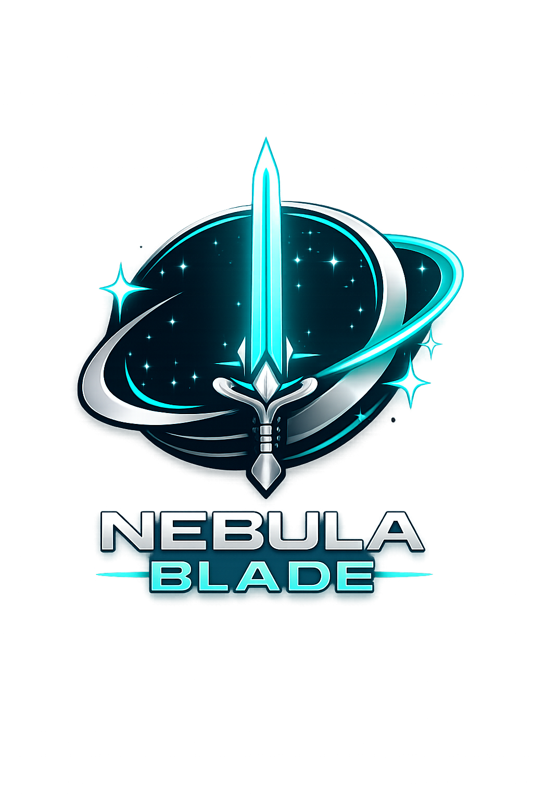

# 🌌 Nebula Blade  
### *An Interactive Galactic Web Experience*

<p align="center">
  
</p>

<p align="center">
  <b>A futuristic sci-fi inspired interactive web application built with HTML, CSS, and JavaScript.</b>
</p>

---

## 🚀 Overview

**Nebula Blade** is an immersive space-themed interactive web project that combines futuristic UI design, animated environments, and game-inspired navigation into a visually engaging experience.

The project simulates a galactic exploration system where users can navigate planets, interact with environments, explore animated interfaces, and experience a cinematic sci-fi atmosphere.

Designed as a creative frontend development project, Nebula Blade focuses on:
- Interactive user experience
- Responsive visual design
- Animation and immersion
- Structured frontend architecture
- Creative storytelling through UI

---

## ✨ Features

### 🌍 Planetary Navigation
Explore different planets with unique visual environments and themed backgrounds.

### 🎮 Interactive Gameplay Interface
Game-inspired layout and navigation system with immersive transitions.

### 🌌 Animated Space Environment
Dynamic stars, nebula effects, layered backgrounds, and atmospheric visuals.

### 🔊 Audio Integration
Interactive sound system with ambient audio and sound effects.

### 🛒 Sci-Fi Shop Interface
Futuristic item/shop system integrated into the experience.

### 📱 Responsive Design
Optimized layout structure for different screen sizes.

---

## 🛠️ Technologies Used

<p>
  
  
  
  
</p>

---

## 📂 Project Structure

```bash
Galactic-game/
│
├── assets/
│   ├── planets/
│   ├── player/
│   ├── enemy/
│   ├── sounds/
│   └── space/
│
├── scripts/
│   ├── audio.js
│   ├── game.js
│   ├── planets.js
│   └── shop.js
│
├── styles/
│   └── style.css
│
├── index.html
├── game.html
├── planets.html
├── shop.html
└── about.html
```

---

## 🎨 Design Inspiration

Nebula Blade draws inspiration from:
- Futuristic space interfaces
- Sci-fi gaming aesthetics
- Galactic exploration themes
- Cinematic UI animations

The visual direction focuses on creating an immersive atmosphere through motion, depth, lighting, and layered design.

---

## 📸 Preview

> Add screenshots here after uploading images to your repository.

Example:

```md


```

---

## 🧠 What I Learned

Through this project, I strengthened my understanding of:
- Frontend architecture
- DOM manipulation
- Interactive UI development
- Asset organization
- JavaScript event handling
- Animation layering
- Responsive web design

---

## 🔮 Future Improvements

- Player progression system
- Backend integration
- Authentication system
- Save/load game functionality
- Advanced animations
- Mobile optimization
- Multiplayer features
- Leaderboards

---

## 👩‍💻 Developer

### Mahlet Wubsera Shumetie

- Information Science Student @ Addis Ababa University
- Aspiring Full-Stack Developer
- Passionate about technology, design, and digital innovation

### 🌐 Connect With Me

- LinkedIn: https://www.linkedin.com/in/mahlet-w-shumetie-b97809340
- GitHub: https://github.com/Mahlet656

---

## ⭐ Support

If you like this project, consider giving it a ⭐ on GitHub!

---

<p align="center">
  <b>“Exploring worlds beyond imagination through code.”</b>
</p>
